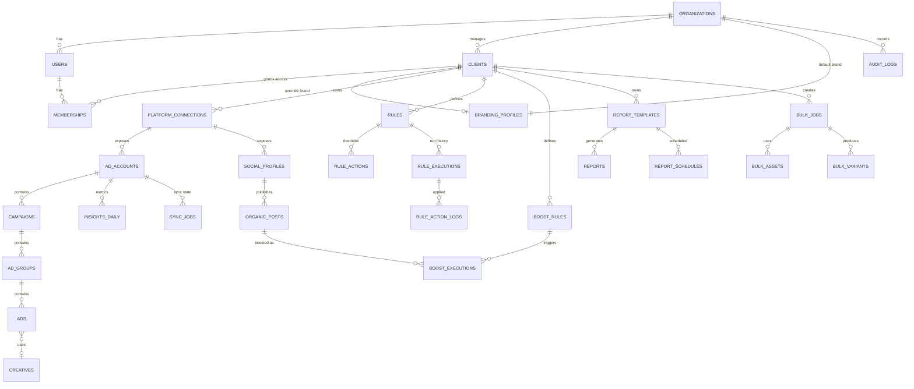

# AdTech Automation & Reporting Dashboard — Teknik Mimari

> **Durum:** Onaylandı (2026-08-03)
> **Kapsam:** Sadece **Meta (Facebook/Instagram)** ve **Google Ads**. TikTok, Snapchat, LinkedIn ve diğer platformlar kapsam dışıdır.
> **Kullanıcı tipleri:** `Admin` (ajans), `Client` (müşteri)

---

## 0. Ön Koşul: Platform Onayları

Bu üründe kod yazmak en kolay kısımdır. Gerçek darboğaz platform onaylarıdır ve
**geliştirmeye paralel, ilk gün** başlatılmalıdır.

| Gereksinim | Tahmini süre | Not |
|---|---|---|
| Meta App Review — `ads_management`, `ads_read`, `business_management`, `pages_read_engagement`, `instagram_basic`, `instagram_manage_insights` | 2–6 hafta | Business Verification + ekran kaydı demo zorunlu |
| Meta **Tech Provider** statüsü | Ek süreç | Müşteri hesaplarını yönetmek için gerekli |
| Google Ads API **Developer Token — Basic Access** | 1–4 hafta | Test token ile yalnızca test hesapları görünür |
| Google OAuth Verification (sensitive scope) | 2–6 hafta | Güvenlik değerlendirmesi istenebilir |

Geliştirme süreci Meta **Dev Tier** + Google **Test Account** ile ilerler.

---

## 1. Teknoloji Seçimi

### Özet

| Katman | Seçim | Reddedilen alternatif |
|---|---|---|
| Frontend | **Next.js 15 (App Router) + TypeScript + Tailwind v4 + shadcn/ui** | Vite + React SPA |
| Tablo / State | **TanStack Table v8 + TanStack Query v5** | AG Grid (lisans), Redux |
| Grafik | **Recharts** (standart) / **visx** (özel görselleştirme) | Chart.js |
| Backend | **NestJS 11 (TypeScript) — modüler monolit** | Python/FastAPI, Express |
| Kuyruk / Cron | **BullMQ + Redis** | node-cron, Celery |
| Veritabanı | **PostgreSQL 16** (aylık partitioning) | MongoDB, ClickHouse (MVP'de) |
| ORM | **Prisma 6** (+ ağır agregasyonlarda raw SQL) | TypeORM, Drizzle |
| Dosya depolama | **S3 / Cloudflare R2** | Local disk |
| PDF | **Playwright headless → PDF** | pdfkit, react-pdf |
| Auth | **NestJS içinde kendi implementasyonumuz** (argon2 + JWT access/refresh, httpOnly cookie) | Auth.js, Clerk, Auth0 |
| Deploy | **Docker + Fly.io / AWS ECS** (worker'lar ayrı servis) | Tam serverless |

### 1.1 Frontend — Next.js 15

- **White-label zorunluluğu:** Rapor paylaşım linkleri (`rapor.musterim.com/r/abc123`) için
  custom domain + SSR şart. Next.js middleware ile host bazlı tenant çözümlemesi ve dinamik
  OG etiketi üretimi doğal gelir. Saf SPA'da bu ek bir edge servisi demektir.
- **PDF bedava gelir:** Rapor sayfası zaten HTML olarak render ediliyor; Playwright aynı route'u
  PDF'e basar. **Tek şablon, iki çıktı.** Ayrı PDF şablon dili bakımı ortadan kalkar.
- **shadcn/ui:** Kod repoya kopyalanır, npm bağımlılığı değildir. Müşteri bazlı tema override
  gerekecek; kilitli bir component kütüphanesi (MUI/Ant) burada engel olur.
- **TanStack Table:** "Ads Explorer" en zor UI'dır — 50+ kolon, sanallaştırma, kolon pinleme,
  sunucu taraflı filtre. Headless olduğu için Tailwind ile tam kontrol verir, lisans maliyeti yoktur.
- **TanStack Query:** Reklam verisi doğası gereği bayattır. `staleTime`, arka plan yenileme ve
  "son güncelleme: 12 dk önce" göstergesi hazır gelir.

### 1.2 Backend — NestJS (modüler monolit)

- **Tek dil = paylaşılan tipler.** Monorepo'da `packages/shared` içinde metrik tipleri, kural
  şeması (Zod) ve API sözleşmeleri tek yerdedir. Frontend/backend arasında tip kayması bu üründe
  doğrudan yanlış rapor demektir.
- **Modül/DI yapısı** PRD'deki 6 modülle birebir eşleşir. Guard/Interceptor katmanı multi-tenant
  izolasyonunu merkezi olarak dayatır — 20 farklı controller'da tek tek kontrol edilmez.
- **Neden mikroservis değil:** MVP'de 6 modül, tek ekip. Modüler monolit + **ayrı worker
  process'leri** (aynı kod tabanı, farklı entrypoint) doğru dengedir. Modül sınırları
  ileride ayrıştırma için hazırdır.

**Bilinen zayıf nokta:** Google Ads API'nin resmi Node.js kütüphanesi yoktur (resmi diller:
Python, Java, PHP, .NET, Ruby, Perl). Node tarafında `google-ads-api` (Opteo) paketi kullanılır —
olgun ve yaygın, ancak topluluk paketidir. Meta'nın ise resmi `facebook-nodejs-business-sdk`'sı vardır.

**Karar:** Tamamen TypeScript. Google Ads entegrasyonu `IAdPlatformProvider` adapter interface'i
arkasına saklanır. Topluluk paketi yetersiz kalırsa yalnızca adapter gRPC/REST'e veya Python
sidecar'a çevrilir; üst katmanlar değişmez. Bu soyutlama zaten "unified workspace" için gereklidir.

### 1.3 Veritabanı — PostgreSQL 16

- **İlişkisel derinlik:** client → hesap → kampanya → ad set → reklam → kural → aksiyon logu.
  Kural motoru finansal sonuç doğurur (bütçe değiştirir, kampanya durdurur) → **ACID zorunludur.**
- **JSONB:** Standart metrikler tiplenmiş kolonlarda, platforma özgü alanlar `raw_metrics JSONB`
  içinde tutulur. GIN index ile sorgulanabilir. Yeni metrik desteği migration gerektirmez.
- **Kural motoru:** İç içe AND/OR koşul ağacı JSONB olarak saklanır (Zod ile doğrulanır).
  Normalize etmek nested mantığı yeniden kurmak demek olurdu.
- **Zaman serisi:** `insights_daily` tablosu `date` üzerinden **aylık declarative partitioning**
  kullanır. Eski partition `DETACH` ile saniyeler içinde arşivlenir, sorgular partition pruning
  ile hızlanır. **TimescaleDB MVP'de kullanılmaz** — hosting seçeneklerini kısıtlar (Supabase/Neon/RDS).
- **Row Level Security (RLS):** `org_id` / `client_id` bazlı politikalar, uygulama katmanındaki bir
  hatada müşterilerin birbirinin verisini görmesini **veritabanı seviyesinde** engeller.
  Ajans ürününde tek sızıntı işi bitirir.
- **Ölçek yolu:** ~500 müşteri / ~100k aktif reklam seviyesinde ad-level + breakdown verisi için
  ClickHouse'a agregasyon offload edilir. MVP'de gereksizdir.

### 1.4 Diğer kritik kararlar

- **BullMQ + Redis (node-cron DEĞİL):** `node-cron` tek process'te çalışır; 2 instance deploy
  edildiği an her kural **iki kez** çalışır ve bütçeyi iki kez artırır. BullMQ repeatable job'ları
  Redis'te kilitlenir → çok-instance güvenlidir. Rate limit, öncelik kuyruğu, retry+backoff ve
  dead-letter queue hazır gelir. **Bu üründe kuyruk altyapısı lüks değil, çekirdektir.**
- **Worker'lar serverless OLMAYACAK:** Meta async insight job'ları dakikalarca sürer, 90 günlük
  backfill saatler alır. API + worker'lar uzun ömürlü container'da çalışır.
- **Token şifreleme:** OAuth refresh token'ları DB'ye asla düz metin yazılmaz. Uygulama katmanında
  AES-256-GCM, anahtar KMS/env'de, `key_version` kolonu ile rotasyon desteklenir.
- **Auth:** NestJS içinde argon2id + JWT (kısa ömürlü access, rotasyonlu refresh). Refresh token'lar
  DB'de hash'lenmiş olarak tutulur ve reuse-detection uygulanır. Next.js sadece httpOnly cookie tüketir.
- **Gözlemlenebilirlik:** Sentry + yapılandırılmış log (pino) + her API çağrısı için kota tüketim
  metriği. Rate limit'e yaklaşıldığı **önceden** görülmelidir.

---

## 2. Veritabanı Şeması (ER)



### A. Kiracılık, Kullanıcı ve Marka  *(Modül 1)*

#### `organizations`
Ajansın kendisi. MVP'de tek satır; reseller/white-label satışı için bu tablo olmadan geriye dönülemez.

| Kolon | Tip | Not |
|---|---|---|
| id | uuid PK | |
| name | text | |
| slug | text UNIQUE | |
| plan | text | `starter` / `pro` / `enterprise` |
| status | text | `active` / `suspended` |
| created_at, updated_at | timestamptz | |

#### `users`

| Kolon | Tip | Not |
|---|---|---|
| id | uuid PK | |
| org_id | uuid FK → organizations | |
| email | citext, UNIQUE (org_id, email) | |
| password_hash | text NULL | SSO'da null |
| full_name | text | |
| avatar_url | text NULL | |
| locale | text | `tr` / `en` |
| mfa_secret_enc | bytea NULL | şifreli |
| last_login_at | timestamptz NULL | |
| status | text | `active` / `invited` / `disabled` |

#### `clients`
Ajansın müşterileri.

| Kolon | Tip | Not |
|---|---|---|
| id | uuid PK | |
| org_id | uuid FK | |
| name | text | |
| slug | text | UNIQUE (org_id, slug) |
| timezone | text | **"Bugün"ün tanımı buna bağlıdır** |
| reporting_currency | char(3) | Çok para birimli toplamada hedef kur |
| status | text | `active` / `paused` / `archived` |

#### `memberships`
Kullanıcı ↔ erişim yetkisi. **RLS'in dayandığı tablodur.**

| Kolon | Tip | Not |
|---|---|---|
| id | uuid PK | |
| user_id | uuid FK → users | |
| org_id | uuid FK → organizations | |
| client_id | uuid FK → clients NULL | **NULL = org geneli erişim (Admin)** |
| role | text | `owner` / `admin` / `manager` / `analyst` / `client_viewer` |
| permissions | jsonb | İnce ayar override (`{"rules.write": false}`) |

> UNIQUE (user_id, client_id) — NULL client_id için partial unique index.

#### `branding_profiles`
White-label çekirdeği.

| Kolon | Tip | Not |
|---|---|---|
| id | uuid PK | |
| org_id | uuid FK | |
| client_id | uuid FK NULL | NULL = org varsayılanı |
| logo_url, logo_dark_url, favicon_url | text | S3/R2 |
| primary_color, accent_color | text | hex |
| font_family | text | |
| custom_domain | text NULL UNIQUE | `rapor.musterim.com` |
| domain_verified_at | timestamptz NULL | |
| email_from_name, email_from_address | text | |
| footer_text | text NULL | |
| hide_powered_by | boolean | |

#### `refresh_tokens`
Oturum yönetimi. Token'ın kendisi değil, **SHA-256 hash'i** saklanır.

| Kolon | Tip | Not |
|---|---|---|
| id | uuid PK | |
| user_id | uuid FK | |
| token_hash | text UNIQUE | |
| family_id | uuid | Rotasyon zinciri — reuse detection |
| expires_at, revoked_at | timestamptz | |
| replaced_by_id | uuid NULL | |
| ip, user_agent | inet, text | |

#### `invitations`, `password_reset_tokens`
Davet ve şifre sıfırlama akışları; tek kullanımlık, hash'lenmiş, süreli token.

#### `audit_logs`
Kim, ne zaman, neyi değiştirdi. Bu üründe bütçeler değişir — pazarlık konusu değildir.

| Kolon | Tip |
|---|---|
| id | bigserial PK |
| org_id, client_id | uuid |
| actor_type | text (`user` / `rule` / `system`) |
| actor_id | uuid NULL |
| action | text (`campaign.paused`, `budget.increased`, `connection.revoked`) |
| target_type, target_id | text |
| before, after | jsonb |
| ip, user_agent | inet, text |
| created_at | timestamptz |

### B. Platform Entegrasyonları  *(Modül 2)*

#### `platform_connections`

| Kolon | Tip | Not |
|---|---|---|
| id | uuid PK | |
| client_id | uuid FK | |
| platform | text | `meta` \| `google` — **enum sabit, 3. platform yok** |
| external_user_id | text | |
| account_label | text | |
| access_token_enc | bytea | AES-256-GCM |
| refresh_token_enc | bytea NULL | Google için zorunlu |
| key_version | int | Anahtar rotasyonu |
| token_expires_at | timestamptz NULL | |
| granted_scopes | text[] | |
| status | text | `active` / `needs_reauth` / `revoked` / `error` |
| last_error_code | text NULL | Meta `#190`, Google `AUTHENTICATION_ERROR` |
| connected_by_user_id | uuid FK | |

#### `ad_accounts`

| Kolon | Tip | Not |
|---|---|---|
| id | uuid PK | |
| client_id, connection_id | uuid FK | |
| platform | text | |
| external_id | text | `act_123456789` / `1234567890` |
| name | text | |
| currency | char(3) | **Hesap para birimi ≠ rapor para birimi** |
| timezone | text | Insight tarihleri bu TZ'dedir |
| status | text | |
| manager_external_id | text NULL | Google MCC / Meta Business |
| sync_enabled | boolean | |
| last_structure_sync_at, last_insights_sync_at | timestamptz | |
| rate_limit_state | jsonb | Son kota okuması |

> UNIQUE (platform, external_id, client_id)

#### `social_profiles`
Auto-Boost için — **sadece Meta**.

| Kolon | Tip | Not |
|---|---|---|
| id | uuid PK | |
| client_id, connection_id | uuid FK | |
| profile_type | text | `facebook_page` \| `instagram_business` |
| external_id, username, name, picture_url | text | |
| linked_ad_account_id | uuid FK | Boost'un faturalanacağı hesap |
| page_access_token_enc | bytea | Page token ayrıdır |

### C. Birleşik Reklam Hiyerarşisi  *(Modül 3–4)*

> **Tasarım kararı:** Meta ve Google **tek şemaya normalize edilir** (Campaign → AdGroup → Ad).
> Meta "Ad Set" ve Google "Ad Group" aynı satıra oturur. "Unified Workspace" ve "Ads Explorer"ı
> mümkün kılan şey budur. Platforma özgü her şey `raw` JSONB'de yaşar.

#### `campaigns`

| Kolon | Tip | Not |
|---|---|---|
| id | uuid PK | |
| ad_account_id | uuid FK | |
| client_id | uuid | Denormalize — RLS + hızlı filtre |
| platform, external_id, name | text | |
| objective | text | Normalize: `conversions`,`traffic`,`awareness`,`leads`,`sales`,`app_promotion` |
| status | text | Normalize: `active`,`paused`,`deleted`,`pending_review`,`ended` |
| effective_status | text | Platform ham durumu |
| budget_mode | text | `daily` \| `lifetime` \| `none` |
| budget_amount_micros | bigint | **Para micros olarak — float asla** |
| bid_strategy | text NULL | |
| start_time, stop_time | timestamptz NULL | |
| raw | jsonb | Ham API cevabı |
| platform_updated_at | timestamptz | Delta sync anahtarı |
| deleted_at | timestamptz NULL | Soft delete |

#### `ad_groups`
`campaigns` ile aynı yapı + `campaign_id` FK, `targeting jsonb`, `optimization_goal`.

#### `ads`
`ad_groups` ile aynı yapı + `ad_group_id` FK, `creative_id` FK, `preview_url`,
`review_status`, `disapproval_reasons jsonb`.

#### `creatives`
`creative_type` (`image`,`video`,`carousel`,`rsa`,`pmax_asset_group`), `headline`,
`primary_text`, `description`, `cta_type`, `destination_url`, `asset_urls jsonb`, `raw jsonb`.

### D. Metrikler (Zaman Serisi) — Sistemin Kalbi  *(Modül 3)*

#### `insights_daily` — **`date` üzerinden AYLIK PARTITIONED**

| Kolon | Tip | Not |
|---|---|---|
| id | bigserial | PK: (date, id) — partition key dahil olmalı |
| client_id, ad_account_id | uuid | |
| platform | text | |
| entity_level | text | `account`\|`campaign`\|`ad_group`\|`ad` |
| entity_id | uuid | |
| entity_external_id | text | Join'siz sorgu için |
| date | date | **Hesabın kendi TZ'sinde** |
| breakdown_key | text | `''` = toplam; yoksa `device:mobile\|country:TR` |
| breakdown | jsonb NULL | |
| impressions, clicks | bigint | |
| spend_micros | bigint | Hesap para biriminde |
| spend_micros_reporting | bigint | `reporting_currency`'ye çevrilmiş |
| conversions | numeric(14,4) | Google kesirli döndürür |
| conversion_value_micros | bigint | |
| video_views, engagements, reach, frequency | bigint / numeric | |
| raw_metrics | jsonb | Platforma özgü tüm alanlar |
| currency | char(3) | |
| fetched_at | timestamptz | Bayatlık göstergesi |

> UNIQUE (entity_level, entity_id, date, breakdown_key) → idempotent `ON CONFLICT DO UPDATE`
> Index: (client_id, date DESC, entity_level) · (ad_account_id, date DESC) · GIN(raw_metrics)

> **Türetilmiş metrikler (CPA, ROAS, CTR, CPM, CPC) DB'de SAKLANMAZ** — sorgu anında hesaplanır.
> Sebep: bölme işlemi toplama sırasına duyarlıdır. `SUM(spend)/SUM(conv)` ≠ `AVG(cpa)`.
> Saklanan CPA, gruplandığında yanlış sayı üretir.

#### `fx_rates`
Meta hesabı TRY, Google hesabı USD ise "kümülatif harcama" ancak bununla doğru olur.

| Kolon | Tip |
|---|---|
| date | date |
| base_currency, quote_currency | char(3) |
| rate | numeric(18,8) |
| source | text |

> PK (date, base_currency, quote_currency)

### E. Senkronizasyon Durumu  *(Modül 3)*

#### `sync_jobs`

| Kolon | Tip | Not |
|---|---|---|
| id | bigserial PK | |
| ad_account_id / social_profile_id | uuid FK | |
| job_type | text | `structure`\|`insights_daily`\|`insights_realtime`\|`backfill`\|`organic_posts` |
| entity_level | text NULL | |
| date_from, date_to | date NULL | |
| status | text | `queued`\|`running`\|`succeeded`\|`failed`\|`throttled`\|`cancelled` |
| priority | int | 1 = interaktif … 10 = backfill |
| attempts, max_attempts | int | |
| api_calls_used, rows_upserted | int | |
| platform_job_id | text NULL | Meta async `report_run_id` |
| error_code, error_message | text NULL | |
| started_at, finished_at, next_retry_at | timestamptz | |

#### `api_usage_log`

| Kolon | Tip |
|---|---|
| id | bigserial PK |
| platform, ad_account_id | text, uuid |
| endpoint | text |
| call_count_pct, cpu_time_pct, total_time_pct | int (Meta BUC header'ları) |
| operations_used | int (Google) |
| http_status, error_code | int, text |
| latency_ms | int |
| created_at | timestamptz |

### F. Kurallar Motoru  *(Modül 5)*

#### `rules`

| Kolon | Tip | Not |
|---|---|---|
| id | uuid PK | |
| client_id | uuid FK | |
| name, description | text | |
| platforms | text[] | `{meta}`, `{google}`, `{meta,google}` |
| scope | jsonb | `{"ad_account_ids":[...],"name_contains":"TR-"}` |
| target_level | text | `campaign`\|`ad_group`\|`ad` |
| condition_tree | jsonb | **Zod ile doğrulanan iç içe AND/OR ağacı** |
| evaluation_window | text | `today`\|`yesterday`\|`last_3d`\|`last_7d`\|`last_14d`\|`last_30d`\|`lifetime` |
| schedule_cron, timezone | text | |
| active_hours | jsonb NULL | "sadece 09:00–22:00 arası çalış" |
| cooldown_minutes | int | Aynı varlığa tekrar dokunma penceresi |
| max_actions_per_run | int | **Patlama sigortası** |
| mode | text | `dry_run` \| `live` — **her kural `dry_run` başlar** |
| is_active | boolean | |
| last_run_at, next_run_at | timestamptz | |

**`condition_tree` örneği:**

```json
{
  "op": "AND",
  "children": [
    { "metric": "spend", "agg": "sum", "operator": "gt", "value": 500, "unit": "currency" },
    { "metric": "roas", "agg": "ratio", "operator": "lt", "value": 1.5 },
    { "op": "OR", "children": [
        { "metric": "cpa", "agg": "ratio", "operator": "gt", "value": 120 },
        { "metric": "ctr", "agg": "ratio", "operator": "lt", "value": 0.008 }
    ]}
  ]
}
```

#### `rule_actions`
IF/THEN/ELSE'in THEN ve ELSE dalları.

| Kolon | Tip | Not |
|---|---|---|
| id | uuid PK | |
| rule_id | uuid FK | |
| branch | text | `then` \| `else` |
| sort_order | int | |
| action_type | text | `pause`\|`resume`\|`increase_budget`\|`decrease_budget`\|`set_budget`\|`adjust_bid`\|`notify_email`\|`notify_slack`\|`notify_in_app`\|`add_label` |
| params | jsonb | `{"mode":"percent","value":20,"max_budget_micros":500000000}` |

#### `rule_executions`

| Kolon | Tip |
|---|---|
| id | bigserial PK |
| rule_id, client_id | uuid |
| run_at | timestamptz |
| trigger | text (`schedule`/`manual`/`backfill_replay`) |
| entities_evaluated, entities_matched, actions_attempted, actions_succeeded, actions_failed | int |
| status | text (`succeeded`/`partial`/`failed`/`skipped_stale_data`) |
| duration_ms | int |

> **`skipped_stale_data` kritiktir:** Veri 2 saattir güncellenmediyse kural **çalışmaz.**
> Bayat veriyle bütçe kapatmak, hiç kural çalıştırmamaktan daha kötüdür.

#### `rule_action_logs`
Geri alma (undo) ve müşteriye hesap verme buradan yürür.

| Kolon | Tip |
|---|---|
| id | bigserial PK |
| execution_id | bigint FK |
| rule_id, client_id | uuid |
| target_type, target_id, target_external_id | text |
| action_type | text |
| matched_snapshot | jsonb (kararı doğuran metrikler) |
| before_state, after_state | jsonb |
| status | text (`applied`/`failed`/`dry_run`/`skipped_cooldown`/`skipped_cap`) |
| platform_response | jsonb |
| reverted_at, reverted_by_user_id | timestamptz, uuid |

### G. Auto-Boost (Sadece Meta)  *(Modül 7)*

#### `organic_posts`

| Kolon | Tip |
|---|---|
| id | uuid PK |
| social_profile_id, client_id | uuid FK |
| external_id | text (profile içinde UNIQUE) |
| media_type | text (`image`/`video`/`carousel`/`reel`/`story`) |
| caption, permalink, thumbnail_url | text |
| published_at | timestamptz |
| likes, comments, shares, saves, reach, impressions, video_views | bigint |
| engagement_rate | numeric(8,5) |
| is_boostable | boolean |
| boost_state | text (`none`/`queued`/`boosted`/`ineligible`/`excluded`) |
| metrics_history | jsonb (hız/ivme hesabı için zaman damgalı snapshot'lar) |

#### `boost_rules`

| Kolon | Tip | Not |
|---|---|---|
| id | uuid PK | |
| client_id, social_profile_id | uuid FK | |
| trigger_conditions | jsonb | `{"engagement_rate":{"gt":0.05},"reach":{"gt":1000},"within_hours":48}` |
| media_type_filter | text[] | |
| caption_include, caption_exclude | text[] | `#reklamsiz` hariç tut |
| min_post_age_hours, max_post_age_hours | int | Erken tetiklenmeyi önler |
| budget_micros, duration_days | bigint, int | |
| objective | text (`engagement`/`traffic`/`conversions`) | |
| targeting | jsonb | |
| daily_boost_cap, monthly_budget_cap_micros | int, bigint | **Harcama sigortası** |
| requires_approval | boolean | true → önce onay kuyruğu |

#### `boost_executions`
`status` (`pending_approval`/`creating`/`active`/`completed`/`failed`/`rejected`),
`trigger_snapshot jsonb`, `created_campaign_id`/`created_ad_group_id`/`created_ad_id`,
`budget_micros`, `spend_micros`, `approved_by_user_id`, `approved_at`.

### H. White-Label Raporlama  *(Modül 6)*

#### `report_templates`
`sections jsonb` (sıralı blok listesi: kpi_row, chart, table, text, image),
`default_date_range`, `branding_profile_id`, `include_platforms text[]`.

#### `reports`

| Kolon | Tip | Not |
|---|---|---|
| id | uuid PK | |
| template_id, client_id | uuid FK | |
| period_start, period_end | date | |
| status | text | `queued`/`generating`/`ready`/`failed` |
| pdf_url | text NULL | S3 imzalı yol |
| share_token | text UNIQUE | URL'deki rastgele slug |
| share_enabled | boolean | |
| share_password_hash | text NULL | |
| share_expires_at | timestamptz NULL | |
| view_count, last_viewed_at | int, timestamptz | |
| data_snapshot | jsonb | **Rapor donmuş veriyle üretilir** — 3 ay sonra aynı link aynı sayıyı gösterir |

#### `report_schedules`
`cron`, `timezone`, `recipients jsonb`, `delivery` (`email_pdf`/`email_link`/`both`),
`is_active`, `last_sent_at`, `next_run_at`.

### I. Toplu Kampanya Oluşturucu  *(Modül 8)*

#### `bulk_jobs`
`spec jsonb` (kampanya/adset iskeleti + varyasyon matrisi),
`status` (`draft`/`validating`/`ready`/`publishing`/`published`/`partial`/`failed`),
`publish_as` (`paused_draft` / `active` — **varsayılan `paused_draft`**),
`total_variants`, `created_count`, `failed_count`.

#### `bulk_assets`
`asset_type` (`image`/`video`/`headline`/`primary_text`/`description`/`cta`/`url`),
`storage_url`, `text_value`, `platform_asset_id` (Meta image hash / Google asset id), `meta jsonb`.

#### `bulk_variants`
`combination jsonb`, `generated_name`, `status` (`pending`/`created`/`failed`/`skipped`),
`created_ad_id`, `external_id`, `error_code`, `error_message`.

### `notifications` + `notification_channels`
Kural uyarıları, bağlantı kopması, boost onay talepleri, rapor hazır bildirimleri tek akışta.
`channel_type`: `email`/`slack_webhook`/`in_app`; `events text[]` aboneliği.

---

## 3. Veri Çekme Mimarisi ve Rate Limit Stratejisi

### 3.1 Gerçekçi Kısıtlar

| | Meta Marketing API | Google Ads API |
|---|---|---|
| Model | **Business Use Case (BUC)** — hesap bazlı, dinamik | **Operations/gün** — developer token bazlı |
| Kota ölçümü | `X-Business-Use-Case-Usage` header'ında **3 ayrı yüzde**: `call_count`, `total_cputime`, `total_time` | Cevapta doğrudan yok; `RESOURCE_EXHAUSTED` ile öğrenilir |
| Yaklaşık limit | Dev Tier ≈ `60 + 400 × aktif reklam` / saat; Standard Tier kat kat üstü | Basic Access ≈ 15.000 op/gün; Standard Access ≈ 1.000.000 op/gün |
| Ceza | %100'e ulaşınca hesap bloklanır (dakikalar–1 saat) | `QuotaError`, retry-after |
| Toplu okuma | **Async Insights Job** (`report_run_id` + polling) + Batch API (50 istek/çağrı) | **`searchStream`** — tek istekte streaming, sayfalama yok |
| Değişiklik takibi | `filtering` ile `updated_time` | **`change_status` / `change_event`** resource'ları |

> Rakamlar yaklaşıktır ve platformlar bunları duyurmadan değiştirir.
> **Mimarinin kuralı: sabit sayılara güvenme, header'daki gerçek tüketimi oku ve ona göre davran.**

### 3.2 Temel İlke: Kimse Canlı API'ye Dokunmaz

```
┌────────────┐   pull    ┌─────────────┐   upsert   ┌────────────┐
│ Meta API   │◄──────────│             │───────────►│            │
│ Google API │◄──────────│  SYNC       │            │ PostgreSQL │
└────────────┘           │  WORKERS    │            │            │
                         │ (BullMQ)    │            └──────┬─────┘
      ▲                  └─────────────┘                   │ read
      │ write (sadece aksiyon)                             ▼
      │                  ┌─────────────────────────────────────┐
      └──────────────────│ Rules Engine │ Dashboard │ Reports  │
                         │ Ads Explorer │ Auto-Boost│ Bulk     │
                         └─────────────────────────────────────┘
```

**Kural motoru API'ye HİÇ okuma yapmaz.** Yalnızca PostgreSQL'den okur; sadece aksiyon anında
yazma çağrısı yapar. 200 kural × 500 kampanya bir saatte tetiklenir ve her biri API'yi sorgularsa,
ilk 10 dakikada tüm müşteri hesapları bloklanır. **Bu, mimarinin en önemli tek kararıdır.**

### 3.3 Katmanlı Senkronizasyon Takvimi

| Katman | Ne | Sıklık | Seviye | Kapsam |
|---|---|---|---|---|
| **L1 — Yapı** | Kampanya/AdSet/Ad meta verisi, durum, bütçe | **6 saatte 1** + kullanıcı tetiklemesi | Tüm hiyerarşi | Delta (Google `change_status`, Meta `updated_time`) |
| **L2 — Sıcak metrik** | Bugünün harcama/dönüşüm verisi | **30 dk** (aktif), 2 saat (düşük harcamalı) | account + campaign | Tek gün |
| **L3 — Günlük tam** | Tüm seviyeler, tüm metrikler | **Günde 1** — hesap TZ'sinde 02:00 | account→campaign→ad_group→ad | Dün |
| **L4 — Geri düzeltme** | Atıf penceresi kaymaları | Günlük son 7 gün, haftalık son 28 gün | campaign + ad_group | Yeniden çekim |
| **L5 — Kırılımlar** | Cihaz, yaş/cinsiyet, konum, yerleşim | **Günde 1**, sadece opt-in hesaplarda | campaign | Dün |
| **L6 — Organik** | IG/FB post etkileşimleri (Auto-Boost) | **Saatte 1** (son 7 günün postları) | post | Delta |
| **L7 — Backfill** | Yeni bağlanan hesap | Bağlantı anında, **en düşük öncelik** | tüm seviyeler | Son 90 gün, 7'şer günlük parça |

**L4 neden zorunlu:** Meta'nın 7 günlük tıklama / 1 günlük görüntüleme atıf penceresi ve Google'ın
dönüşüm gecikmesi nedeniyle **dünün verisi 3 gün sonra hâlâ değişir.** Bir kez çekip bırakılırsa
ROAS sistematik olarak eksik raporlanır — ve kurallar bu eksik veriyle kampanya kapatır.

**L2 neden sadece campaign seviyesi:** Gün içi ad-level veri çekmek kota tüketimini 20–50× artırır.
Kural motorunun gün içi kararları için campaign seviyesi yeterlidir; ad-level analiz gün sonu yapılır.

### 3.4 Kota Yönetimi

**Sabit pencere sayacı + adaptif eşik, `ad_account_id` başına.** Her API çağrısından önce
`QuotaGuardService.acquire()` çağrılır:

1. Circuit breaker açık mı — açıksa iş kalan süre kadar geciktirilir
2. Katmanın eşiği, hesabın bilinen kota yüzdesini aşıyor mu
3. Dakikalık sayaç kovası dolmuş mu
4. Reddedilirse → iş `moveToDelayed` ile kuyruğa iade, **worker bloklanmaz**
5. Çağrı yapılır; Meta `X-Business-Use-Case-Usage` header'ı / Google hata kodu okunur
6. `record()` Redis durumunu ve `api_usage_log` satırını yazar

*Token bucket değil, sabit pencere sayacı:* dakika başına sıfırlanan bir `INCR` sayacı,
token doldurma zamanlayıcısı gerektirmiyor ve tek Redis komutuna iniyor. Pencere sınırında
iki katı çağrı yapılabilmesi teorik olarak mümkün; adaptif eşik ikinci savunma olarak
durduğu için bu risk kabul edildi.

**Adaptif eşikler** (üç yüzdenin en yükseğine göre). Kod: `LAYER_MAX_USAGE`.

| Tüketim | Davranış |
|---|---|
| < %60 | Normal hız |
| %60–75 | Dakikalık bütçe yarıya iner, L5/L7 duraklar |
| %75–90 | Dakikalık bütçe çeyreğe iner; L4/L6 de durur |
| > %90 | **Tam fren** — sadece kural aksiyonları ve kullanıcı istekleri geçer |
| %100 / blok | Circuit breaker açılır, 15 dk cooldown |

**Kota rezervi — dakikalık bütçe iki ayrı kovaya bölünür:**

| Kova | Pay | Katmanlar |
|---|---|---|
| Senkronizasyon | %65 | L1–L7 |
| Öncelikli | %35 | `rule_action`, `interactive` |

Kota bittiği için bütçe artıramamak, veri güncellenememekten çok daha pahalıdır.

Kovaların **ayrı sayaçlar** olması şart. Tek sayaçla rezerv işlemiyor: sınırı aşan sync
denemeleri de sayacı artırıyor (sayacı geri almak yarış koşulu yaratır), sayaç öncelikli
limiti de geçiyor ve kural aksiyonu — eşiği izin vermesine rağmen — reddediliyor.

**Kota durumunun TTL'i (10 dk) aynı zamanda kurtarma mekanizmasıdır.** Platform %100
bildirirse hiçbir katman çalışamaz (en yüksek eşik %98); çağrı yapılamayınca yeni yüzde de
öğrenilemez. Tek çıkış yolu durumun süresinin dolması: yüzde bilinmiyor sayılır, bir yoklama
çağrısı gider ve platform güncel yüzdeyi bildirir. Bu yüzden circuit breaker **kota yüzdesi
yazmaz** — yazsaydı blok kalktıktan sonra da eşikten reddedilmeye devam eder ve 15 dakikalık
kesinti saatlere çıkardı.

### 3.5 Çağrı Sayısını Azaltan Teknikler

| Teknik | Kazanç |
|---|---|
| **Meta:** `time_increment=1` ile 30 günü tek çağrıda satır satır al | 30 çağrı → 1 |
| **Meta:** Büyük sorgularda **Async Insights Job** + polling | Timeout yok, kota dostu |
| **Meta:** Batch API — 50 istek tek HTTP çağrısında | ~50× az round-trip |
| **Google:** `searchStream` + tek GAQL'de `segments.date` | Sayfalama yok, tek operasyon |
| **Google:** `change_status` ile sadece değişen varlıkları çek | L1 maliyetinin ~%90'ı gider |
| Sadece kullanılan alanları iste (`fields` / SELECT listesi) | CPU time yüzdesini düşürür |
| `sync_enabled=false` hesapları hiç sorgulama | Ölü hesap maliyeti sıfır |
| Harcaması 0 olan hesapları düşük frekans grubuna al | Kotayı aktif hesaplara kaydırır |

### 3.6 Hata ve Dayanıklılık

| Durum | Tepki |
|---|---|
| Rate limit (Meta `#17`/`#613`, Google `RESOURCE_EXHAUSTED`) | Exponential backoff + jitter, `throttled`, kuyruğa iade |
| Token geçersiz (Meta `#190`, Google `AUTHENTICATION_ERROR`) | `status='needs_reauth'`, job'ları duraklat, **e-posta + UI banner** |
| Geçici sunucu hatası (5xx, Meta `#1`/`#2`) | 5 denemeye kadar retry |
| Kalıcı hata (geçersiz alan, silinmiş varlık) | Retry yok → DLQ + soft delete |
| Aynı işin iki kez çalışması | BullMQ `jobId` deduplication + DB `ON CONFLICT` idempotency |
| Uzun süren Meta async job | `platform_job_id` kaydedilir; worker yeniden başlasa bile polling sürer |

**Circuit breaker `ad_account_id` seviyesindedir** (`platform:hesap` anahtarı). Bağlantı
seviyesinden daha ince: Meta'nın BUC kotası hesap bazlı olduğu için bir hesabın bloklanması
aynı bağlantıdaki diğer 39 hesabı durdurmamalı. Bir müşterinin bozuk bağlantısı da diğer
müşterilerin senkronizasyonunu yavaşlatamaz.

### 3.7 Kullanıcı Tarafında Şeffaflık

- Her dashboard'da **"Son güncelleme: 14 dk önce"** + manuel yenile butonu
  (hesap başına 5 dk debounce, en yüksek öncelikli kuyruk).
- Veri bayatsa (> 2 saat) **sarı uyarı bandı**; kural motoru da `skipped_stale_data` ile durur.
- Bağlantı koptuğunda kırmızı banner + "Yeniden bağlan" akışı.
- Admin panelinde kota tüketim grafiği (`api_usage_log`'dan) — hangi müşteri kotayı yiyor görünür olsun.

### 3.8 Hacim Tahmini

Günlük satır ≈ `Σ(hesap başına reklam sayısı) × ~1.3` (üst seviyeler dahil).

| Ölçek | Günlük satır | Yıllık satır | Yaklaşık boyut |
|---|---|---|---|
| 20 müşteri / ~2.000 reklam | ~2.600 | ~950K | < 1 GB |
| 100 müşteri / ~15.000 reklam | ~20.000 | ~7M | ~5 GB |
| 500 müşteri / ~100.000 reklam | ~130.000 | ~47M | ~35 GB + kırılımlar |

Aylık partitioning ile 500 müşteri seviyesine kadar tek PostgreSQL rahat taşır. Kırılım verisi (L5)
bunu 5–10× katlar — bu yüzden L5 **opt-in**'dir.

---

## 4. Geliştirme Sıralaması

| Modül | Kapsam | Durum |
|---|---|---|
| **1** | Auth + multi-tenant iskelet + RLS | 🚧 Devam ediyor |
| **2** | Platform bağlantıları (OAuth) + Provider adapter | ⏳ |
| **3** | Sync worker'ları + Unified Dashboard | ⏳ |
| **4** | Ads Explorer | ⏳ |
| **5** | Rules Engine | ⏳ |
| **6** | White-Label Reporting | ⏳ |
| **7** | Auto-Boost (Meta) | ⏳ |
| **8** | Bulk Campaign Creator | ⏳ |

## 5. Değişmez Güvenlik Varsayılanları

1. **Her kural `dry_run` modunda oluşur.** Kullanıcı en az 1 başarılı kuru çalıştırma görmeden
   `live` moda geçemez. Bütçeye dokunan bir üründe bu güven ilk günden kurulur.
2. **Bulk Creator varsayılanı `paused_draft`.** Toplu üretim asla doğrudan yayına girmez.
3. **Auto-Boost'ta günlük ve aylık harcama tavanı zorunludur.**
4. **RLS her tenant tablosunda açıktır ve `FORCE` edilmiştir.** Uygulama katmanı atlanamaz.
5. **OAuth token'ları asla düz metin saklanmaz.** AES-256-GCM + `key_version`.
6. **Bayat veriyle otomatik aksiyon alınmaz.** `skipped_stale_data`.
